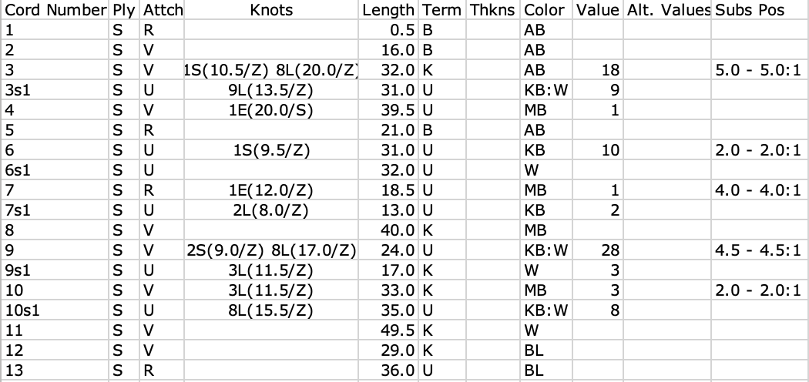
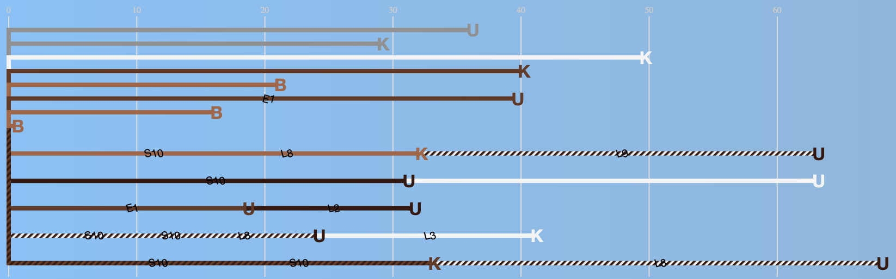

# khipuviz
Full interface available here: [http://www.khipu.online](http://www.khipu.online)

From [Khipu Database Project](https://khipukamayuq.fas.harvard.edu/):

"Khipu are knotted textile record-keeping devices used by the Inkas. The Inka empire extended throughout the Andes and lasted from about 1400 A.D. until the Spanish Conquest of Peru in 1532."

The project linked above contains data tables representing known khipu. This project here (khipuviz) is for displaying computer-generated standardized visualizations of khipu, based on features defined in the data tables.

For example, here is how khipu UR019 is represented in the data:

And here is how we visualize it:

